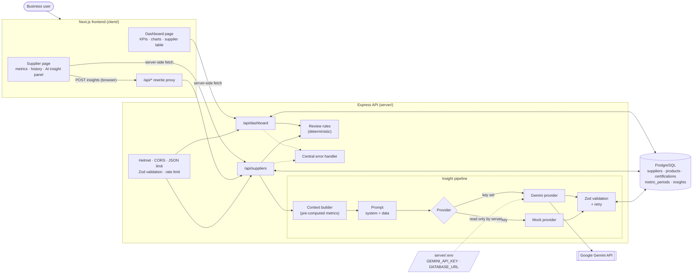
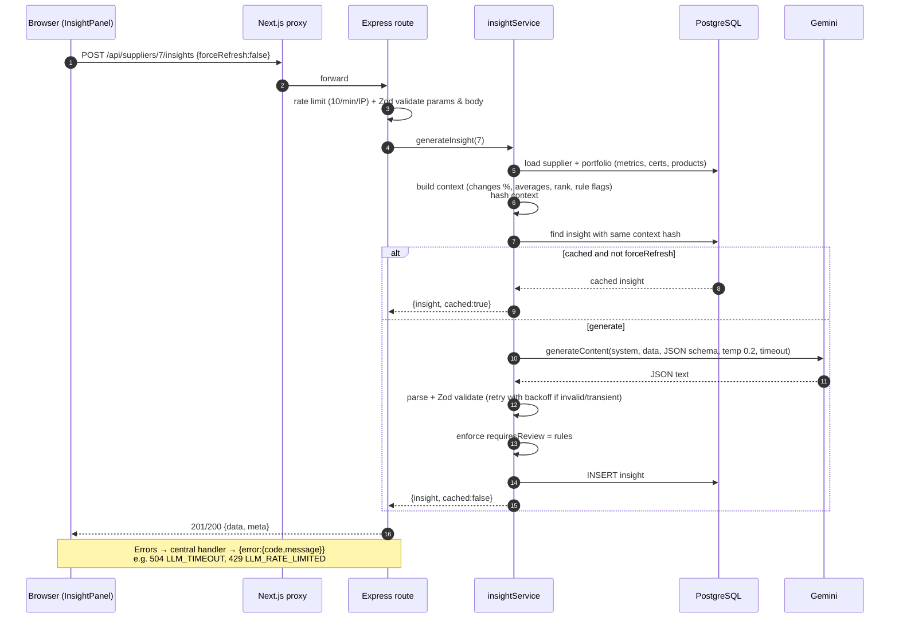
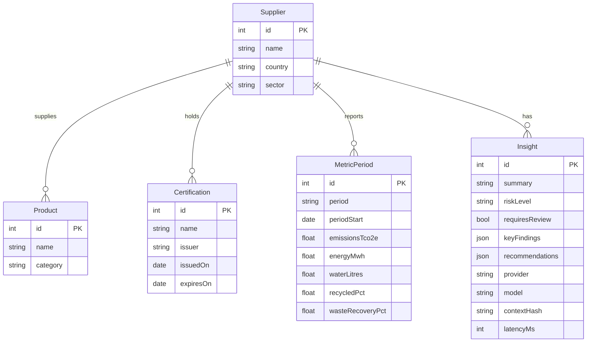

# Architecture

## Components

**Key boundaries**

- The browser never calls Gemini and never sees the API key. It only talks to our own `/api`, which Next.js proxies to Express.
- The API key exists only in `server/.env`. It is loaded and validated in `server/src/config/env.ts`, and it isn't logged or returned by any endpoint.
- The "requires review" decision is made by plain code (`reviewRules.ts`). The LLM explains the decision; it doesn't make it.

## Insight request flow

## Data model

